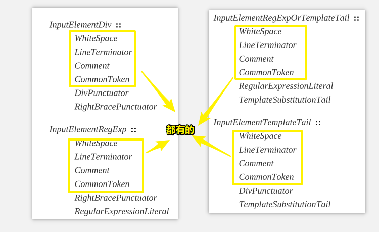
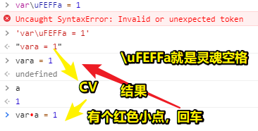
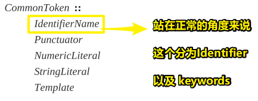

# 01-整理JS

## ★产出

## ★解释

同学HTML一样，我们对JS 也是从维度的角度去看

但JS是门编程语言，而学所有编程语言都有一个通用的方法论，即可这样看一门语言：

- JS
  - Grammar
  - 语义
  - 运行时

> Grammar分为lex和syntax（同HTML作为计算机语言看一样，即分为词法和语法），但我们翻译的时候，Grammar可以叫做语法，而syntax也叫做语法，但它们俩其实是总分关系，所以我们在这里写的是「Grammar」，而不是「语法」，不然写语法的话，就与syntax有冲突了……

> semantics（语义）与syntax（语法）这俩单词长得有点像，一般来说，它们俩关联比较紧密

1）词法

如何看这东西？（标准的A附录）

Lexical是Lex这个名词的形容词形式，简单来说它就是词法之意

在词法里边，规定了一个输入的基本元素是啥样的，所有的语言都有一个「Input Element」的概念，即**输入的最小元素**

而在JS里边有四种「Input Element」，但winter认为这是一种神经病一样的设计，总之这种设计是为了特殊的语法结构，当然，这对于我们而言，并不需要去探讨……

> Div有区分、分开之意

我们只需要关注几种基本的输入即可，如：

- WhiteSpace
- LineTerminator
- Comment
- Token

> 为啥不是Common Token，而是Token？ -> winter说这是按照逻辑去理的，因为要从逻辑上避开JS 的这种语法和词法的特殊性技巧，总之，它只有四类的输入元素

#### 1、WhiteSpace

就是空格之意，JS支持unicode里边所有表示空白的空格，如「灵魂空格写代码」：

> 复制返回的那个字符串，然后粘贴，客观上还是可以起到「`var a = 1`」这样的作用 -> 这个可以忽悠人，我们假装给他看 `vara = 1`这样的代码，然后告诉他说我可以对这代码施展魔法，让浏览器不报错……然后运行一下……结果他一定会傻眼…… -> 魔法代码

从完备性的角度来看，任何一个合法的unicode的whitespace都可以作为JS 的whitespace来使用……

#### 2、LineTerminator

换行符，其实就是打个回车啦！

其实，在一些语言里边，换行符也被归为whitespace，因此，其实从通用语言的角度来看，词法就分为「whitespace」、「comment」、「Token」

那么为啥JS会搞出那么几个input Element呢？

之前JS就两个，一个是`InputElementDiv`，另一个则是`InputElementRegExp`，像 `RightBracePunctuator`、`CommonToken`、`DivPunctuator`、`RightBracePunctuator`等这样的都属于Token

只是词法里边有一些冲突，所以必须得定义这么多个，但winter认为这样不太好，因为这过于伪代码了……

总之，我们从概念上理解的话，它一共有4类的输入

#### 3、Comment

同whitespace和LineTerminator一样，注释也没啥好讲的

#### 4、Token

前三类输入很简单，最复杂的是Token

那么Token有什么呢？——它分为以下这么几类：

还有一个`RegularExpressionLiteral`

**①Identifier & keywords & FutureReservedWord：**

标识符，俗称变量名，由于它既可叫做函数名又可叫做属性名，所以叫做Identifier

为啥标准里边把Identifier和keywords塞到在一起，搞成是「IdentifierName」呢？

因为ES5之后，你写 `a.class`、`a.function`等这样的属性是合法的，但在ES5之前，这样写是不合法的，即合在一起，keywords也可以作为属性名了，但一般我们都不会用keywords作为属性名

所以我们在这里做了一个拆分

**②Punctuator（符号）：**

> 除号`/`，为了处理正则表达式的冲突

➹：[javascript - What does `InputElementDiv` stand for in ECMAScript lexical grammar - Stack Overflow](https://stackoverflow.com/questions/45722082/what-does-inputelementdiv-stand-for-in-ecmascript-lexical-grammar)

**③NumericLiteral、StringLiteral、RegularExpressionLiteral：**

都是直接量，即直接写一个东西，如写个2.3就是数值2.3，同理0.1、0.3也是如此，但0.1就是真得0.1吗？（不是哈！）

也可以叫字面量、直接值等等，不同翻译不同叫法

JS的特色：语法上能实现正则表达式，如new一个正则出来，但就是搞个 `/regularExpression/`这样的字面量

**④Template：**

字符串模板 -> 特别坑

本来在ES5里边，input Element是两个，但现在ES10这个版本则是4个了，而这就是Template搞的鬼！

5、小结

Lex这个内容，基本上可以把JS里边所有的内容都给覆盖一遍，即你写的任何一个有效的JS里边，离不开这个词法，即Token+辅助的空白符、注释、换行符，不过这个时候，对这些东西的理解只限于这单个这样的一个一个的词

还需要用语法（syntax）去把它们整合到一起

 

